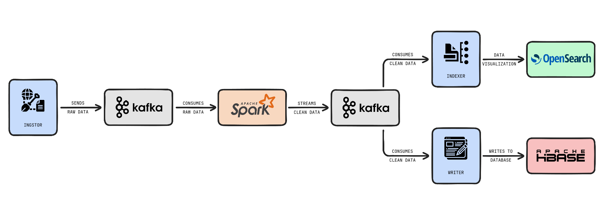

# WikiTrends

A real-time data pipeline for detecting and analyzing trending topics on Wikipedia using open-source big data tools. The system ingests, processes, aggregates, and indexes Wikipedia edit events, making trending topics available for search and analytics.

## Features
- **Real-time ingestion** of Wikipedia edit events
- **Stream processing** and windowed aggregation with Apache Spark
- **Indexing** into OpenSearch for search and analytics
- **Archival** to HBase for historical analysis
- **Modular microservices** architecture with Docker Compose

## Architecture



- **ingestor**: Streams Wikipedia edit events from Wikimedia EventStreams into Kafka.
- **streamer**: Spark Structured Streaming job that cleans, enriches, and aggregates events in sliding windows, publishing trending topics back to Kafka.
- **indexer**: Consumes windowed trending topics from Kafka and indexes them into OpenSearch.
- **writer**: Consumes windowed trending topics from Kafka and writes them to HBase for archival.

## Services

- **Kafka & Zookeeper**: Message broker for streaming data between services.
- **OpenSearch**: Search and analytics engine for trending topics.
- **OpenSearch Dashboards**: Visualization UI for OpenSearch data.
- **Hadoop & HBase**: Distributed storage and NoSQL database for historical data.
- **Spark**: Stream processing engine for windowed aggregations.

## Directory Structure

- `ingestor/`   – Wikipedia event ingestion service
- `streamer/`   – Spark streaming and aggregation service
- `indexer/`    – OpenSearch indexing service
- `writer/`     – HBase archival service
- `conf/`       – Configuration files (OpenSearch templates, init scripts)
- `docker-compose.yml` – Multi-service orchestration

## Prerequisites

Before starting the project, ensure you have:
- Docker installed and running (Docker Desktop for Windows/Mac or Docker Engine for Linux)
- Docker Compose installed (included with Docker Desktop)
- Git for cloning the repository
- At least 8GB of free RAM for running all services

## Getting Started

1. **Clone the repository**
   ```sh
   git clone https://github.com/MohamedAli-BenLtaief/WikiTrends.git
   cd WikiTrends
   ```

2. **Start the Docker services**
   ```sh
   docker-compose up --build
   ```
   This will start all required services. The first run will take longer as it needs to:
   - Download all required Docker images
   - Build the custom service images
   - Initialize Kafka, Hadoop, HBase, and OpenSearch

3. **Wait for services initialization (2-3 minutes)**
   - Wait for all services to be healthy
   - You can monitor the status using:
     ```sh
     docker-compose ps
     ```

4. **Initialize OpenSearch templates**
   Choose the appropriate script based on your operating system:

   For Linux/MacOS:
   ```sh
   ./conf/opensearch/init-templates.sh
   ```

   For Windows (PowerShell):
   ```powershell
   ./conf/opensearch/init-templates.ps1
   ```
   This step creates the necessary index templates and initial indices for storing trending topics data.

5. **Access the Dashboards**

   **OpenSearch Dashboards:**
   - URL: http://localhost:5601
   - Configure index patterns:
     1. Go to Stack Management → Index Patterns
     2. Create index patterns for `trending-1m*` and `trending-5m*`
     3. Set `ts_bucket` as the time field
     4. Go to Discover to start exploring the data
   - Default visualizations:
     - Trending topics by score
     - Edit activity over time
     - Top wikis by edit count

   **HBase UI:**
   - URL: http://localhost:16010
   - View table: `rc_clean_minute`
   - Monitor table metrics

## Monitoring and Troubleshooting

- **Kafka:**
  - Topics: `wikimedia.recentchange.raw`, `trending.windows.1m`, `trending.windows.5m`
  - Port: 9092

- **OpenSearch:**
  - REST API: http://localhost:9200
  - Health check: http://localhost:9200/_cluster/health

- **HBase:**
  - REST API: http://localhost:8085
  - Region server UI: http://localhost:16030

- **Hadoop:**
  - NameNode UI: http://localhost:9870
  - DataNode UI: http://localhost:9864

## Configuration
- All service connection details are set in `docker-compose.yml`
- OpenSearch and HBase are exposed on standard ports for local access
- Spark streaming configuration (windows, watermarks) can be adjusted in `streamer/streamer.py` 